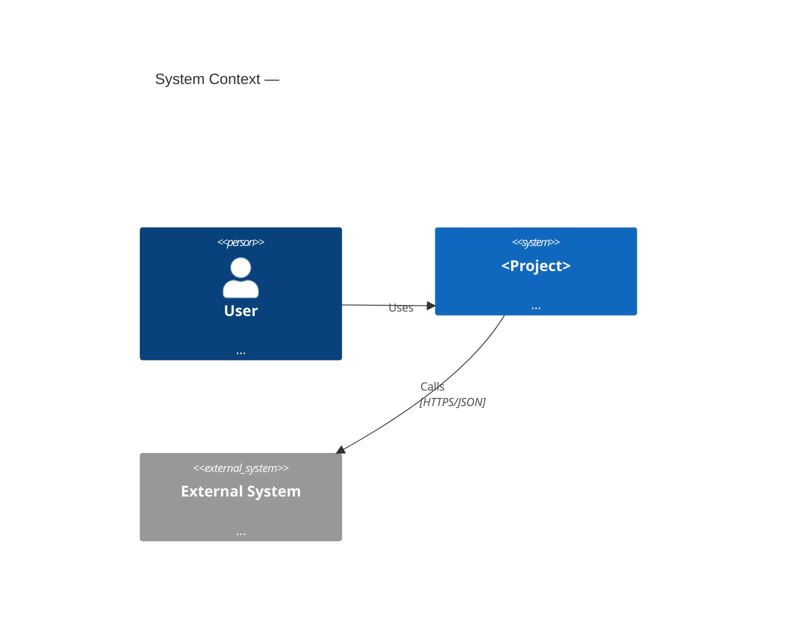
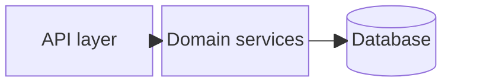
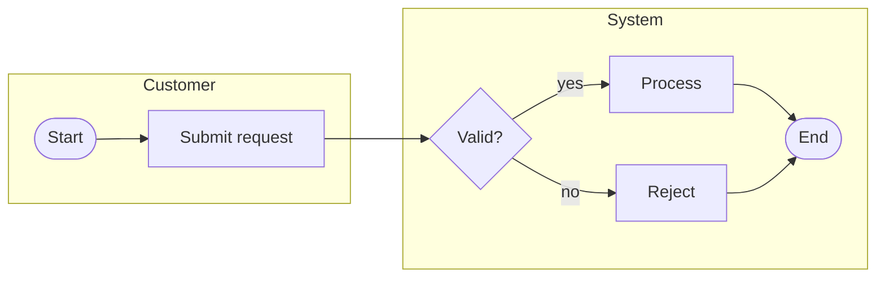
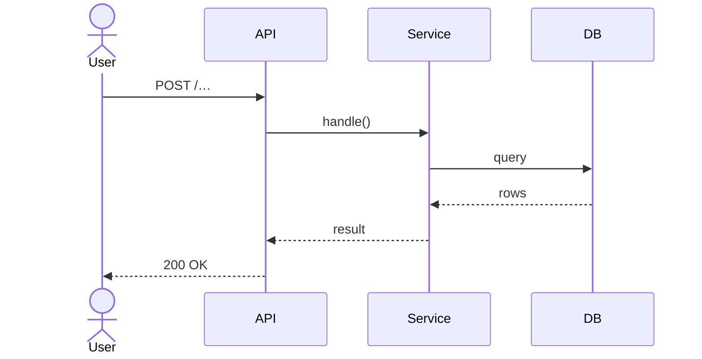
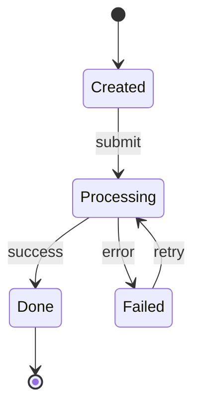

# <Project> — Technical Documentation

> **Cross-project template.** Every project's documentation follows this exact section
> order so docs are uniform across the portfolio. Keep the headings; fill or mark
> `N/A — <reason>`. Do not delete sections. Diagrams are **Mermaid** unless noted.

## 1. Overview

One paragraph: what the system does and the value it delivers. Then:

- **Owner / team:** …
- **Primary users / actors:** …
- **Repository:** `<url>` · analyzed at `ref` = `<sha>`
- **Stack:** …
- **Runtime / deployment:** …

## 2. Business context & requirements

- **Problem / goal:** …
- **Key business requirements:** bullet list, each traceable to a feature.
- **Scope & non-goals:** what this system does *not* do.
- **Constraints / assumptions:** …

## 3. Glossary

| Term | Meaning |
|------|---------|
|      |         |

## 4. System context (C4)

Who/what interacts with the system and across which boundaries.

## 5. Components / containers (Block diagram)

Internal decomposition — modules, services, datastores, queues.

## 6. Entry points & endpoints

Detected from source. One row per entry point. Fill `Auth`, `Description`, and the
handler location (`file:line`).

| # | Type | Method | Path / Trigger | Handler (`file:line`) | Auth | Description |
|---|------|--------|----------------|-----------------------|------|-------------|
| 1 | HTTP | GET    | /…             | `…:NN`                | …    | …           |

> **Entry-point conventions by stack** (what the analysis skill scans):
> - **Laravel** — `routes/api.php`, `routes/web.php`, `#[Route]`/controller methods, Artisan commands, queued jobs, scheduler (`app/Console/Kernel.php`).
> - **Quarkus** — JAX-RS `@Path` + `@GET/@POST/…`, `@Scheduled`, Kafka `@Incoming/@Outgoing`.
> - **Spring** — `@RestController` + `@RequestMapping/@GetMapping/…`, `@KafkaListener`, `@Scheduled`.
> - **FastAPI** — `@app/@router.<method>` decorators, `APIRouter` includes, background tasks, startup/shutdown events.
> - **Vue.js** *(frontend entry points)* — `vue-router` routes, `main.ts` bootstrap, page/view components, API-client calls to the backend.

## 7. Business processes (BPMN)

Model the key end-to-end business process(es).

> [!NOTE]
> Mermaid has **no native BPMN**. Use one of:
> 1. a `flowchart` that approximates the BPMN (lanes as `subgraph`), embedded below, **or**
> 2. a diagram authored in a BPMN tool, exported to PNG/SVG and embedded as an image with
>    the source `.bpmn` file committed next to this doc.

## 8. Key scenarios (Sequence)

One sequence diagram per important flow / critical endpoint.

## 9. Algorithms & logic (Flow / State)

Describe non-trivial algorithms and stateful lifecycles.

## 10. Data model

Entities, key fields, relationships (table form; ER diagram optional).

| Entity | Key fields | Relationships | Store |
|--------|-----------|---------------|-------|
|        |           |               |       |

## 11. Integrations & external contracts

Outbound/inbound integrations, payload schemas, sync/async boundaries, failure modes.

| Integration | Direction | Protocol | Contract / schema | Failure handling |
|-------------|-----------|----------|-------------------|------------------|
|             |           |          |                   |                  |

## 12. Configuration & environment

Env vars, secrets (names only), feature flags, external URLs.

## 13. Observability

Logs, metrics, health checks, alerts — where to look when it breaks.

## 14. Open questions & risks

- …

## 15. Doc-sync & changelog

| Date | Author | Change | Verified against commit |
|------|--------|--------|-------------------------|
|      |        |        |                         |

> Keep `last_verified_commit` in the frontmatter equal to the newest commit the doc was
> checked against. The doc-watch workflow flags drift when the repo moves ahead of it.
